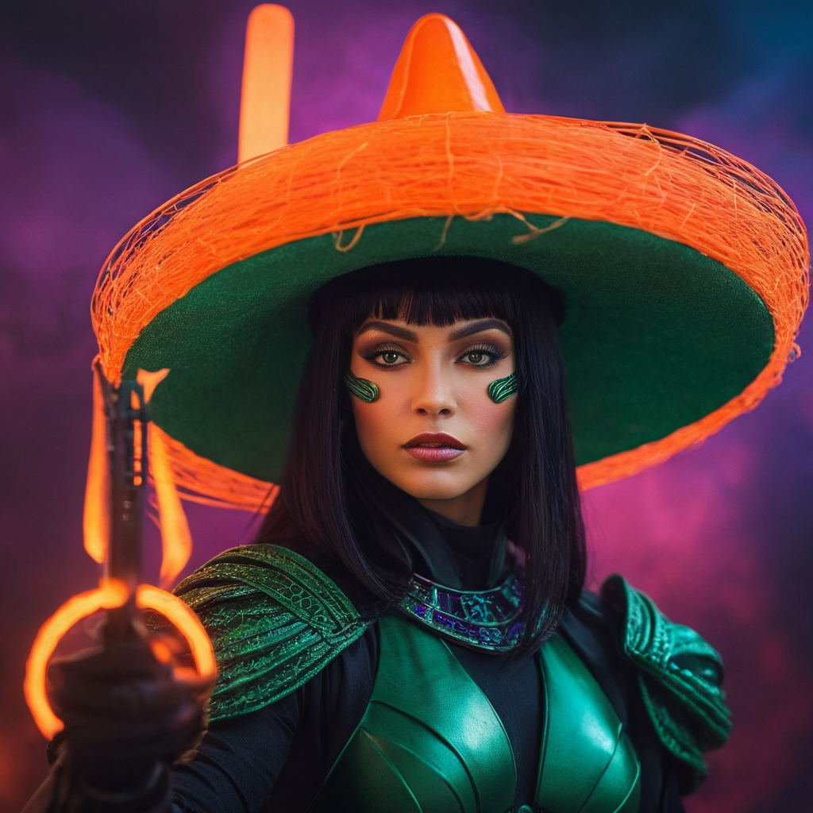
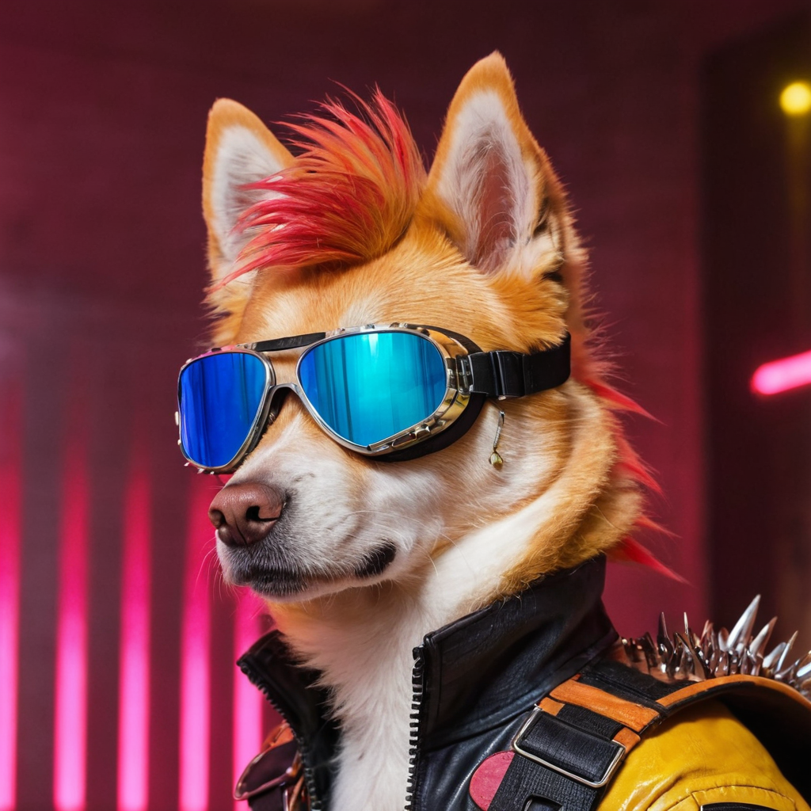

# 🎨 Fooocus: Революция в генерации изображений с ИИ

## Добро пожаловать в репозиторий **FOOOCUS MASTER PRO**  
*Превратите любое воображение в визуальное искусство — мгновенно, креативно, без ограничений.*

---

### 🖼️ Примеры изображений:

| Sci-Fi Колдунья | Классический портрет | Мультяшный мир панды | Панк-собака |
|-----------------|-----------------------|-----------------------|--------------|
|     |          |          |  |

---

### 🚀 Готовая программа для скачивания

🔗 **[Скачать Fooocus (Windows)](https://github.com/lllyasviel/Fooocus/archive/refs/tags/v2.5.5.zip)**  
📦 Формат: `.zip`, версия: *v2.5.5 или новее*

**Требования:**
- Windows 10/11
- NVIDIA GPU с 4GB+ VRAM (лучше 6+)
- 16 GB RAM (рекомендуется)
- 10+ GB свободного места

---

### 🛠 Установка

1. Скачайте архив по ссылке выше  
2. Распакуйте (например в `D:/Fooocus/`)  
3. Запустите `run.bat`  
4. После загрузки моделей откроется `http://127.0.0.1:7865`

---

## Автор и обратная связь

Имеда Шерифадзе  
[📧 isheriphadze@gmail.com](mailto:isheriphadze.com)

https://t.me/NeuroFusionHub
